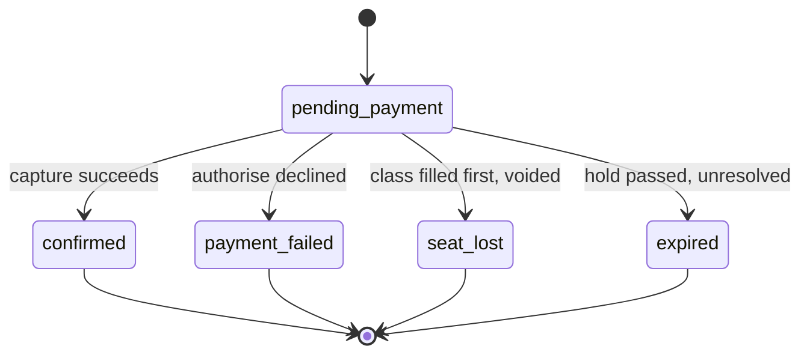

# ottodot trial booking

## 1. Design philosophy

This implementation prioritises correctness over completeness. Rather than a
feature rich booking platform, the focus is the four backend invariants the
assignment names: duplicate prevention, capacity enforcement, correct payment
outcomes, and resolution of concurrent booking attempts. Other production
features, authentication, refunds, cancellation, notifications, were
deliberately excluded so the core behaviour stays easy to inspect, verify and
reason about. Everything present exists to make one of those four
invariants demonstrable, not to round out a product.

## 2. Where to look

| File | What it proves |
| --- | --- |
| `db/migrations/001_init.sql` | the invariants, and where they live |
| `src/domain/booking.service.ts` | the confirmation sequence |
| `tests/last-seat-race.test.ts` | the proof, deterministic, no sleeps |
| `tests/duplicate.test.ts` | the invariant holds when the service layer is bypassed |

## 3. Quick start

```bash
git clone https://github.com/pgs401/ottodot-trial-booking.git
cd ottodot-trial-booking
cp .env.example .env
npm install
npm run db:reset
npm run db:seed
npm test
```

Any PostgreSQL instance works by pointing `DATABASE_URL` elsewhere, so Docker
is a convenience here, not a requirement.

## 4. Verify it

| Edge case | Command |
| --- | --- |
| Duplicate prevention | `npx vitest run tests/duplicate.test.ts` |
| Capacity enforcement | `npx vitest run tests/last-seat-race.test.ts -t "never exceeds four confirmed students"` |
| Correct payment outcomes | `npx vitest run tests/booking.test.ts` |
| Resolution of concurrent booking attempts | `npx vitest run tests/last-seat-race.test.ts -t "exactly one is confirmed"` |

`npm test` output reads as a specification of what the system guarantees.
`db/invariants.sql` can also be run by hand: `psql "$DATABASE_URL" -f
db/invariants.sql`.

## 5. Concurrency and the last seat race

Correctness in `confirmBooking` comes from four layers, each with one job.
The transaction is the consistency boundary. The `FOR UPDATE` lock on the
booking row serialises this path against the expiry job and against a
double submit of the same booking. The conditional update arbitrates
between different bookings racing for the same seat: it is the central
mechanism, but not the only one. The `CHECK` constraint is the backstop
that keeps the ceiling unreachable if every layer above it is wrong.

**Why this holds at READ COMMITTED.** The conditional update does not read
then decide; it decides inside a single statement, so READ COMMITTED's
guarantee that a writer sees the latest committed row is exactly what the
arbitration needs. A second concurrent update targeting the same row blocks
behind the first until it commits, then evaluates its own `WHERE` clause
against the row that commit left, not a stale snapshot. Nothing here
depends on repeatable reads or ordering across statements, because there is
one statement that matters and Postgres serialises writers to the same row.

**Rejected alternatives, in order.**

`SELECT FOR UPDATE` on the class row, then count. Rejected because
correctness then depends on every future caller remembering to take the
lock, and nothing in the schema enforces that. The conditional update puts
arbitration inside the statement, so the guarantee travels with the
operation.

A `seat_no` column, unique per class among confirmed rows. This would
eliminate counter drift, and was rejected for two reasons.
Allocating the next free seat number is itself a race that would need a
retry loop on unique violation. A `CHECK` constraint cannot reference
capacity on another table, so bounding `seat_no` would need either a
hardcoded ceiling that destroys per class capacity, or a trigger heavier
than the counter it replaced.

SERIALIZABLE with a retry loop. Correct, but costly for one hot row.

Count then insert: the naive baseline, a time of check to time of use race
where two callers both read three and both insert.

The tradeoff accepted is the denormalised counter. `confirmed_count` can
drift from the rows it summarises if something writes around the service
layer. It is checked, by the `CHECK` constraint and by
`db/invariants.sql`, rather than made structurally impossible.

## 6. Payment handling

Confirming a booking authorises payment, claims the seat, then captures. If
the class filled first, the authorisation is voided instead, so no funds
are captured. The provider is a test fixture with scriptable outcomes, not
the subject of this exercise.

The transaction holds a lock on the class row across the capture call. This
is deliberate: it buys atomicity, so the seat and the captured payment
commit together or neither does. Cost: concurrent confirmations for one
class serialise behind a single payment round trip, immaterial at four
seats, not at high volume, where the fix is splitting claim and capture
with a reconciliation worker, the same worker named under limitations for
unhandled capture failure. Both are the same problem.

## 7. Data model

Five tables. `parents` has a unique email, so the same guardian cannot open
a second account. `students` has a foreign key to `parents` on delete
cascade, indexed, so a deleted parent cannot leave orphaned rows.

`trial_classes` carries the `CHECK` constraint
`trial_classes_capacity_not_exceeded`, keeping `confirmed_count` between
zero and capacity. It is the backstop, not the primary mechanism.

`bookings` has three foreign keys, all on delete restrict rather than
cascade, all indexed, so a parent, student or class with live bookings
cannot be deleted out from under the seat count. Its partial unique index,
`bookings_one_active_per_student_class` on `(student_id, trial_class_id)
WHERE status IN (pending_payment, confirmed)`, is the duplicate guard. That
`pending_payment` sits inside the predicate is why an abandoned booking can
briefly lock out a retry, which is why an expiry job exists, which needs a
terminal state that means neither success nor decline, which is why the
status `expired` exists.

`payment_attempts` has a foreign key to `bookings` on delete cascade,
indexed, recording every authorise, capture and void: the audit trail a
reviewer reads on the booking status page.

## 8. Booking status



## 9. Where each check belongs

| Check | UI | Backend | Database | Background job |
| --- | --- | --- | --- | --- |
| Child belongs to parent | filter dropdown | authorise per request | foreign key | |
| Class in the future | hide past classes | reject | | |
| Seats remaining | display only | advisory read | | |
| Duplicate booking | warn early | map error | partial unique index enforces | |
| Capacity of four | display only | interpret result | CHECK plus conditional update enforce | |
| Payment outcome | show status | record every attempt | attempt history | |
| Last seat race | never | void on loss | row lock arbitrates | |
| Stale holds | | | | expiry job |
| Counter drift | | | | invariants query in tests |

The interface exists for speed and courtesy, the backend for policy, the
database for truth, and background jobs for eventual consistency. No
invariant is enforced only in the interface or only in the backend.

## 10. Why PostgreSQL

PostgreSQL was chosen because it lets row level locking, transaction
boundaries and concurrent booking behaviour be demonstrated directly.
SQLite would also satisfy the assignment. PostgreSQL better illustrates the
concurrency guarantees because the arbitration is visible in the design
rather than supplied by the engine serialising all writes by default. On
raw SQL: for a codebase that lives for years a typed query builder is the
right default, but here the schema is the deliverable, so it is written in
the form a reviewer reads it in.

## 11. Scope

**Built.** The schema and its two named invariants, a domain service that
performs the four step confirmation sequence under lock, a mock two phase
payment fixture, an HTTP API and a thin server rendered UI, and a ten case
integration suite run against a real database.

**Cut, one line each.** No event log table, the booking and payment_attempts
rows already are the history. No idempotency key columns, because the
partial unique index plus `SELECT FOR UPDATE` already make one unnecessary.
No capture failure and refund path. No cancellation flow. No
authentication. No separate verification endpoint, because the test suite
already proves these invariants, and two mechanisms checking the same
property can disagree with each other.

## 12. Limitations, monitoring and next steps

**Limitations.** The seat counter can drift and is checked rather than made
structurally impossible; a failed void leaves an authorisation to expire
naturally; capture failure after a successful seat claim is unhandled and
would need a `refund_due` status and a reconciliation worker; a crash
between capture and commit orphans a capture; there is no authentication,
so parent identity is trusted from the request.

**Monitor.** The `seat_lost` rate, the authorise decline rate, counter
drift detections, the hold expiry backlog, and p99 latency on confirm.

**Next, by value.** A reconciliation worker for unresolved captures, the
largest financial risk; authentication, since parent identity is just
trusted; a cancellation flow, since a confirmed seat cannot be released; an
event log, once more than one team needs to ask what happened and why.

## 13. Time spent, by phase

Schema, migrations and the two named invariants: the smallest share, mostly
settled once the invariants were decided.

The domain service and concurrency correctness, including the last seat
race test: the largest share, and worth it.

The HTTP API, the UI and the payment fixture: a moderate share, comparatively
mechanical once the domain service existed.

Verification and this document: a small, final share, spent closing the
gaps a reviewer would hit first.
